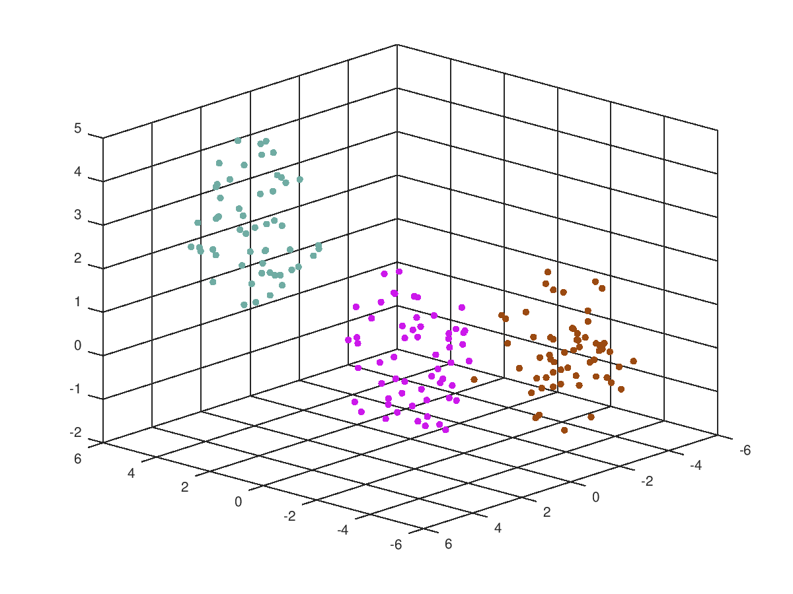
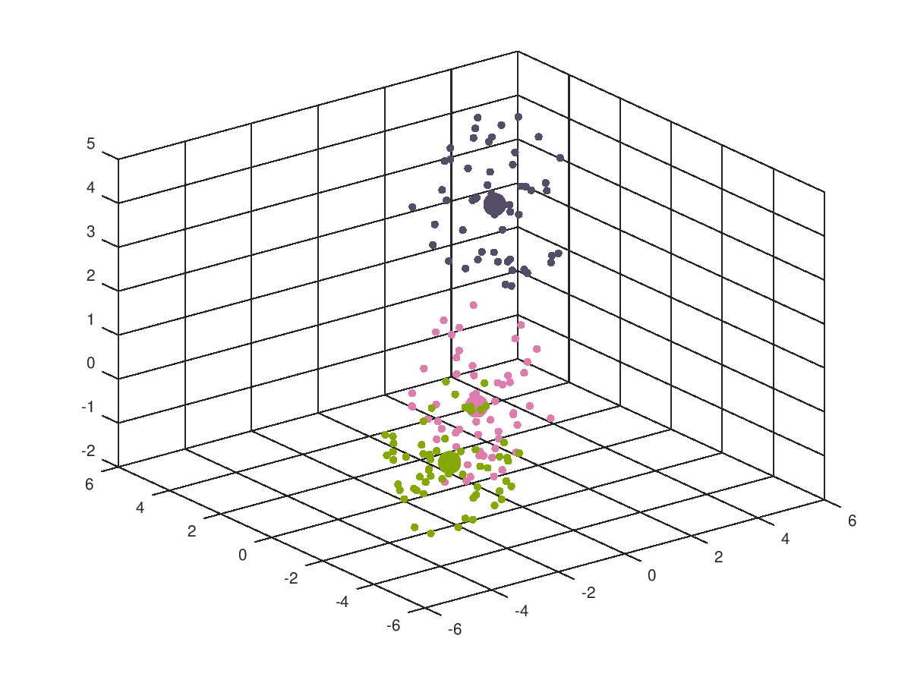
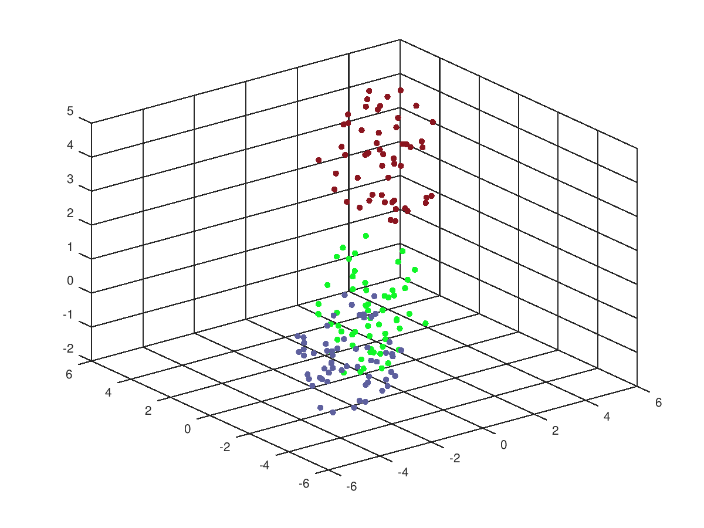
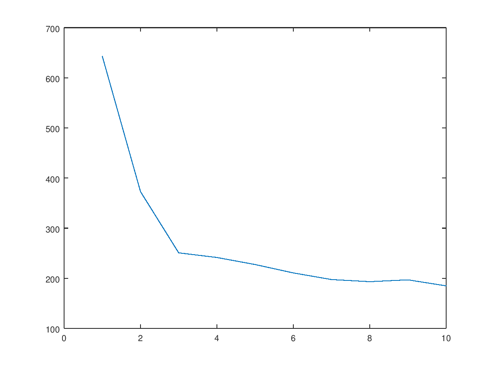

# NM Homework #1 - __K-MEANS__

This is the first homework for the numerical method class. The task was to implement a 'K-Means' algorithm, along with some auxiliary functions.

# Clustering and K-Means
Clustering algorithms are used to group certain data in different groups, in such a way that all the elements will have similar propreties.

K-Means is one of the most popular algoritms used in cluster analysis.

# Implementation
There are 5 main files/function, each solving one task.
# `read_input_data`

This function will read the number of clusters and the points that need to be clustered.
One problem I had was the fact that when I load the points, they are loaded as an object containing the points matrix. I didn't realise this untill later, because the test for this
task didn't show any problem. Probably, the test can work with this king of objects.
The problem was solved by simply extracting the points matrix from the object.

# `clustering_pc`

This is the actual K-Means algorithm. It was split into other 3 functions, to be easier to implement. The algorithm has 3 main steps:

1. Assign random points as centroids ( as many centroids as required by the NC-number of clusters parameter)
2. Assign each point to the closest centroid
3. Recalculate the clusters center(centroid), as the average of its elements positions

The steps 2 & 3 are repeated untill the clusters don't change anymore.

One problem that might occur is that the centroid is not computed correctly, because the centroids are chosen randomly at the start. For example, this can lead to some cases where the centroids were chosen too close to one another.
This problem can appear from time to time in the 2nd test.

# `view_clusters`

This function is quite simple. It determines to what cluster is each point assigned to, generates a color for each cluster, and then plots the points. There is a variable that can be changed by modifying the function, `plot_centroids`. As it is implied by its name, you can change the value to true and see where the centroid is located
The only problem I had implementing this was to understand how `scatter3` works.

## Plot Centroids - ON

## Plot Centroids - OFF

# `compute_cost_pc`

The "cost" of a cluster is the sum of the distances, from each point to the centroid.
This functions returns the total cost of the algorithm, the sum of all the costs.

Because it is dependend on the `clustering_pc` function, it also fails sometimes the 2nd test.

# `view_cost_vs_nc`

This functions draws a graph that shows the "number of clusters - total cost" relation.

This was quite simple to implement and it didn't raise any problem, as the `plot` was simple to use.

© 2019 Grama Nicolae, 312CA
